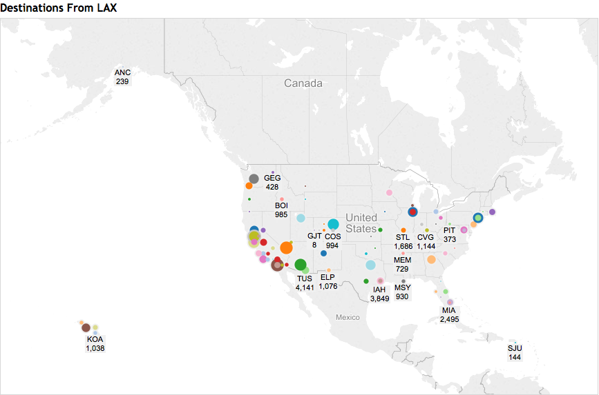
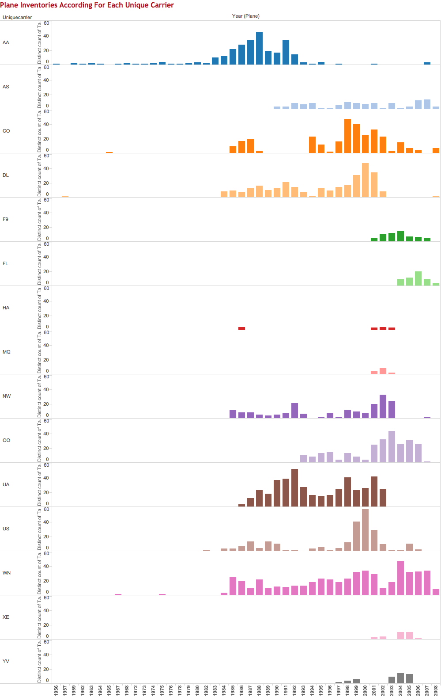
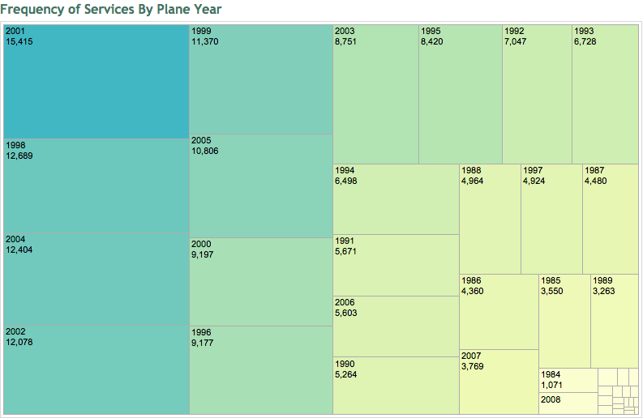
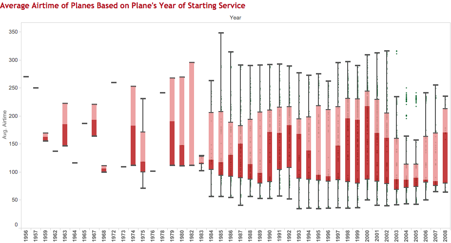
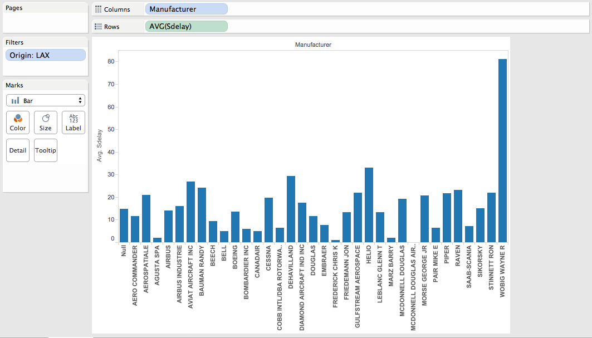
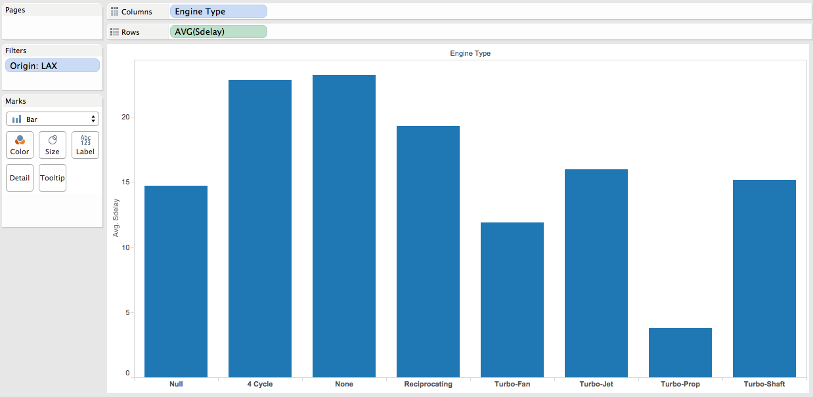

In this R Markdown document we will display and document each step of CS329e R Project 6.

Project Requirements <http://www.cs.utexas.edu/~cannata/dataVis/Projects/Tableau%20Project%203/Project%20Requirements.html>.

***Data(Blending) Description***

We blended our data between three different date sets. The first data set is called "FT". It has the flight information for 2008 in the United States, including the amount of delay for each flight.It has a fair amount of information on the planes themselves, including the Tail Number as well as the Year it was manufactured. The second data set is called "Plane".  It has a lot more information about the different planes present in 2008 such as the manufacturer, its aircraft type, engine type, etc. Our final dataset is called "Airports"", which has the latitude and longitude of the different airports. This is very helpful for visualizations using Tableau's geography feature. We combined FT and Plane through the FT:Tailnum and Plane:Tailnum. We combined FT and Airports though FT:Dest and FT:Iata (which stands for International Air Transportation Assocation codes used to identify airports as as shorthand).  We chose destination instead of origin to blend the two datasets because we are only trying to visualize the destinations.  

***Destination Services From LAX***
First visualization produced from data blending - FT & airports

***Tableau Steps to Reproduce***

+ Click on Data > Edit Relationships... Then, blend FT and airports datasets by FT.Dest and airports.iata
+ Drag and drop FT.Origin on Filter and filter only by 'LAX'
+ Drag and drop airports.latitude to Rows and airports.longitude to Column
+ Click on Show Me and choose Symbol Maps
+ Drag and drop the FT.Number of Records and FT.Dest to Label in Marks section
+ Drag and drop the FT.Number of Records to Size in Marks section
+ Drag and drop the FT.Dest to Color in Marks section
+ Right click and choose Annotate > Point and enter the latitude to create a mark for LAX, the origin airport

***Graph Description***
- The visualization above illustrates all the destinations catered by unique carriers originated from Los Angeles International Airport (LAX). It shows that airlines based in LAX offer flight services at far as San Juan (bottom lower right point), Hawaii (HNL & OGG) and Alaska (ANC).

***Plane Inventory by Unique Carrier***
We are interested to know more about unique carriers and their planes that are currently operating. Thus, we create a visualization of plane inventories for each unique carrier. We wanted to count the distinct number of planes that owned by unique carrier but we couldn't do so using the data blending technique and resorted to joining the tables between FT and plane in a single data source instead. The following image shows the detail of the join that we made.

***Tableau Steps to Reproduce***

+ Drag and drop FT.Origin on Filter and filter only by 'LAX'
+ Drag and drop plane.Year(Plane) to Columns and FT.Uniquecarrier to Rows
+ Filter plane.Year(Plane) so as only to include non-zero values
+ Drag and drop FT.Tailnum(Plane) to Rows and upon right-click choose Measure > Count(Distinct)
+ Drag and drop FT.Uniquecarrier to Marks > Color

#

***Graph Description***
- It can be observed from the bar graphs above that not many older planes are currently being operated. Many planes that are currently use for flight services are from mid-80s till mid-00s. Based on the plane inventories, we can also gauge the operation size of the unique carriers in LAX - FL, F9, YV, XE, for instance, do not own many planes and therefore may not offer as much services as AA or may not offer services for further destinations.

***Frequency of Service by Age of plane***
We thought it is interesting to visualize the number of flight services done by the plane based on their active year. Again, this is done through joining FT & plane in a single data source (no data blending here). We use treemaps as visualization method. 

***Tableau Steps to Reproduce***

+ Drag and drop FT.Origin in Filters and choose only 'LAX'
+ Drag and drop plane.Year(plane) to Columns 
+ Filter plane.Year(Plane) so as only to include non-zero values
+ Drag and drop FT.number of records in Marks > Text
+ Click Show Me > Treemaps

#

***Graph Description***
- The treemaps shows that planes with many flight services are those from late 1990s till mid-2000s. This got us curious about the average distance of destinations catered by the planes based on their age bracket and this leads us to produce the next visualization. It is worth noting that we used airtime instead of distance because we assume that airtime is proportional to distance.

***Avg Airtime by Age of plane***
Second visualization produced using data blending - FT & plane. We are interested to see the average airtime for all the planes based on their age (Year). 

***Tableau Steps to Reproduce***

+ Drag and drop Tailnum on Marks to establish link joining both data source
+ Drag and drop FT.Origin in Filters and choose only 'LAX'
+ Drag and drop plane.Year to Columns and FT.Airtime to Rows
+ Drag and drop FT.Airtime in Filters to filter the null values.
+ Right click on FT.Airtime, choose Measure > Average
+ Filter plane.Year(Plane) so as only to include non-zero values
+ Drag and drop FT.Year to Marks > Color 
+ Drag and drop FT.Uniquecarrier to Marks > Color

  

***Graph Description***
- The above visualization demonstrates a correlation between higher frequency of service and longer airtime. This means that many of the flight services that depart from LAX cater to longer-distance travel that spans from 3-5 hours on average.
- It is quite surprising to observe that newer planes do not have higher average airtime. However, lack of data on plane sizes prevents us from making better guesses - chances are the planes that started their service in 2008 maybe smaller in size and therefore used for shorter flight services.

***Relation between Manufacturer and Average Total Delay***

***Tableau Steps to Reporduce***

+ Place SDelay in Rows.  That stands for the total amount of delay in the flight.  Make sure that the aggregate is average or AVG.
+ Then place Manufacturer on columns.
+ Put origin in the filter tab and change it to filter out everything except LAX.
+ I chose a bar graph because it is more easily readable than an also appropriate line graph.
+ This is blending between FT and Airplane

***Graph Description***

+ This graph allows you to see see the relation between the manufacturer of the airplane and the average total delay for the planes of each manufacturer.  It filters out the results to only focus on the average delays for planes flying out of LAX airport.  Based off the graph, I would be afraid of flying out of LAX by planes from the Wayne Wobig R manufacturer.  

#

**Relation between Aircraft Engine and Average Total Delay**

***Tableau Steps to Reproduce***

+ Place SDelay in Rows.  That stands for the total amount of delay in the flight.  Make sure that the aggregate is average or AVG.
+ Then place Engine Type on columns.
+ Put origin in the filter tab and change it to filter out everything except LAX.
+ I chose a bar graph because it is more easily readable than an also appropriate line graph
+ This is blending between FT and Airplane

***Graph Description***

+ This graph allows you to see see the relation between the engine type of the airplane and the average total delay for the planes of each manufacturer.  It filters out the results to only focus on the average delays for planes flying out of LAX airport.  Based off the graph, I would be choose a flight that uses an airplane with a Turbo-Prop engine.    

#

                

