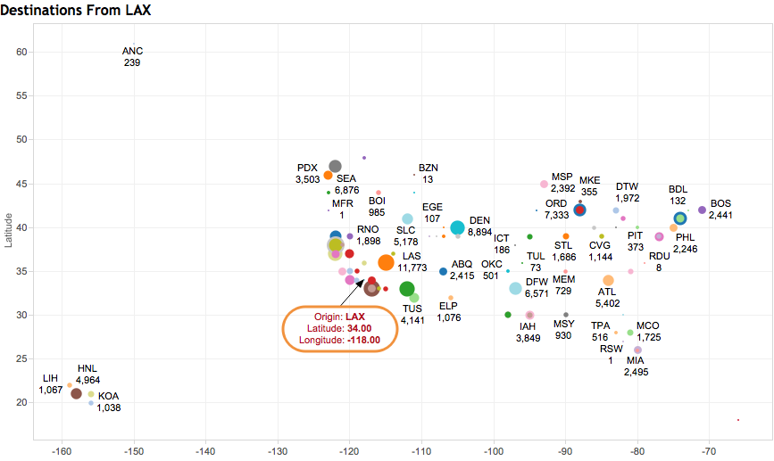

In this R Markdown document we will display and document each step of CS329e R Project 6.

Project Requirements <http://www.cs.utexas.edu/~cannata/dataVis/Projects/Tableau%20Project%203/Project%20Requirements.html>.

***Describe Data(Blending)***

We blended our data between three different date sets.  
The first data set is called "FT".  It has the flight information for 2008 in the United States, including the amount of delay for each flight.  It has a fair amount of information on the planes themselves, including the Tail Number as well as the Year it was manufactured.  
The second data set is called "Plane".  It has a lot more information about the different planes present in 2008 such as the manufacturer, its aircraft type, engine type, etc. 
Our final dataset is called "Airports"", which has the latitude and longitude of the different airports.  This is very helpful for visualizations using Tableau's geography feature.  
We combined FT and Plane through the FT:Tailnum and Plane:Tailnum.  

#

We combined FT and Airports though FT:Dest and FT:Iata (which stands for International Air Transportation Assocation codes used to identify airports as as shorthand).  We chose destination instead of origin to blend the two datasets because we are only trying to visualize the destinations.  

#

***Destination Services From LAX***

***Describe Tableau Steps***
-  Give a brief description of steps to reproduce

***Describe Graph***
- A brief explanation for each of the visualizations.
- Visualization results that are accurate, clear, and elegant.
  (1) Convey meaningful features of the data, and 
  (2) Use different techniques.

To create the visualization above, one would have to
- Drag and drop FT.Origin on Filter and filter only by 'LAX'
- Drag and drop airports.latitude to Rows and airports.longitude to Column
- Click on Show Me and choose Symbol Maps
- Drag and drop the FT.Number of Records and FT.Dest to Label in Marks section
- Drag and drop the FT.Number of Records to Size in Marks section
- Drag and drop the FT.Dest to Color in Marks section

***Plane Inventory by Carrier***

***Describe Tableau Steps***
-  Give a brief description of steps to reproduce

***Describe Graph***
- A brief explanation for each of the visualizations.
- Visualization results that are accurate, clear, and elegant.
  (1) Convey meaningful features of the data, and 
  (2) Use different techniques.

#

***Avg Airtime by Age of plane***

***Describe Tableau Steps***
-  Give a brief description of steps to reproduce

***Describe Graph***
- A brief explanation for each of the visualizations.
- Visualization results that are accurate, clear, and elegant.
  (1) Convey meaningful features of the data, and 
  (2) Use different techniques.
  
#

***Most Active Month for Airtravel***

***Describe Tableau Steps***
-  Give a brief description of steps to reproduce

***Describe Graph***
- A brief explanation for each of the visualizations.
- Visualization results that are accurate, clear, and elegant.
  (1) Convey meaningful features of the data, and 
  (2) Use different techniques.

#

**Relation between Manufacturer and Average Total Delay**

***Tableau Steps***
*    Place SDelay in Rows.  That stands for the total amount of delay in the flight.  Make sure that the aggregate is average or AVG.
*    Then place Manufacturer on columns.
*    Put origin in the filter tab and change it to filter out everything except LAX.
*    I chose a bar graph because it is more easily readable than an also appropriate line graph.
*    This is blending between FT and Airplane

***Graph Description***
*    This graph allows you to see see the relation between the manufacturer of the airplane and the average total delay for the planes of each manufacturer.  It filters out the results to only focus on the average delays for planes flying out of LAX airport.  Based off the graph, I would be afraid of flying out of LAX by planes from the Wayne Wobig R manufacturer.  

#

**Relation between Aircraft Engine and Average Total Delay**

***Tableau Steps***
*    Place SDelay in Rows.  That stands for the total amount of delay in the flight.  Make sure that the aggregate is average or AVG.
*    Then place Engine Type on columns.
*    Put origin in the filter tab and change it to filter out everything except LAX.
*    I chose a bar graph because it is more easily readable than an also appropriate line graph*    This is blending between FT and Airplane

***Graph Description***
*    This graph allows you to see see the relation between the engine type of the airplane and the average total delay for the planes of each manufacturer.  It filters out the results to only focus on the average delays for planes flying out of LAX airport.  Based off the graph, I would be choose a flight that uses an airplane with a Turbo-Prop engine.    

#

                

